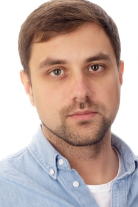

# Free Stas Gorelik

 
 
{: style="height:300px;width:200px"}

In the early hours of Wednesday, August 12th, scholarly researcher Stas Gorelik was wrongfully arrested and jailed in Belarus. State security agents, presumably from the Belarusian KGB, entered his parents’ home and conducted a thorough search. They did not find or remove anything, but arrested Stas and took him to jail.

Stas is a PhD student at George Washington University (GWU). His research is not on Belarus, but rather on other countries. He is a Belarusian citizen who had to return home to Minsk in order to renew his U.S. visa. Unfortunately, U.S. policy changes related to the COVID-19 pandemic prevented him from renewing his visa and returning to Washington to resume his doctoral studies. 

The arrest and detention of academic researchers is of great concern to not only friends and family but to the larger academic community. We strongly urge a reconsideration of the circumstances surrounding his arrest, and appeal to the authorities for his immediate and unconditional release.

# Statements in Support

- Joint statements from the [Association for the Study of Nationalities](https://nationalities.org/news-archive/asn-statement-on-detention-of-stas-gorelik) and the [Association for Slavic, East European, and Eurasian Studies](https://www.aseees.org/advocacy/statement-concerning-detention-stas-gorelik)

- [British Association for Slavonic and East European Studies](https://basees.org/news/2020/8/13/basees-statement-on-recent-developments-in-belarus)

- [George Washington University](https://gwtoday.gwu.edu/statement-detention-gw-doctoral-student-stas-gorelik)

# Ways to Help Stas

- Tweet your support with the hashtag [#FreeStas](https://twitter.com/hashtag/FreeStas?src=hash)

- Contact members of the media to get the word out about Stas's detention

# Media Coverage of Stas's Detention

- [BBC Sounds - August 13](https://www.bbc.co.uk/sounds/play/m000lmyt): Interview with Marisa Durham, Stas's girlfriend, about the arrest; scroll to 2:38:30.

- [Forum Daily - August 13](https://www.forumdaily.com/en/protesty-v-belarusi-7-tysyach-zaderzhannyx-zhenskie-zhivye-cepi-podderzhka-ot-diaspory-ssha/)

- [Academe Blog - August 13](https://academeblog.org/2020/08/13/against-the-detention-of-academic-researcher-stas-gorelik/)

- [New Belarus / Center for New Ideas - August 12](https://newbelarus.vision/gorelik-detained)

- [Stas’s Academic Work](https://politicalscience.columbian.gwu.edu/stas-gorelik)

# More Information on the Situation in Belarus

- [BBC - Belarus Election](https://www.bbc.com/news/world-europe-53760453)

 
 
 
 

We will update this page as we learn more about the situation. 
 

Political Science Department  
George Washington University  
Washington, D.C.  

pscgrad@gwu.edu
